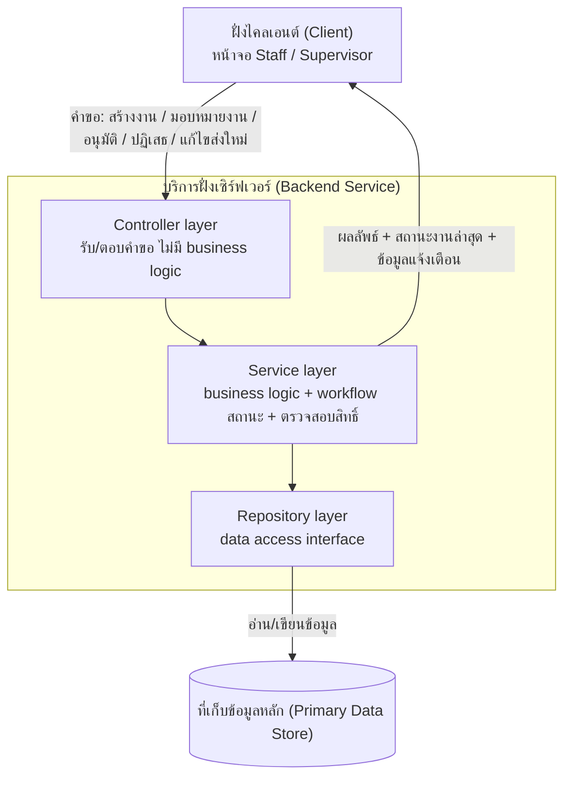
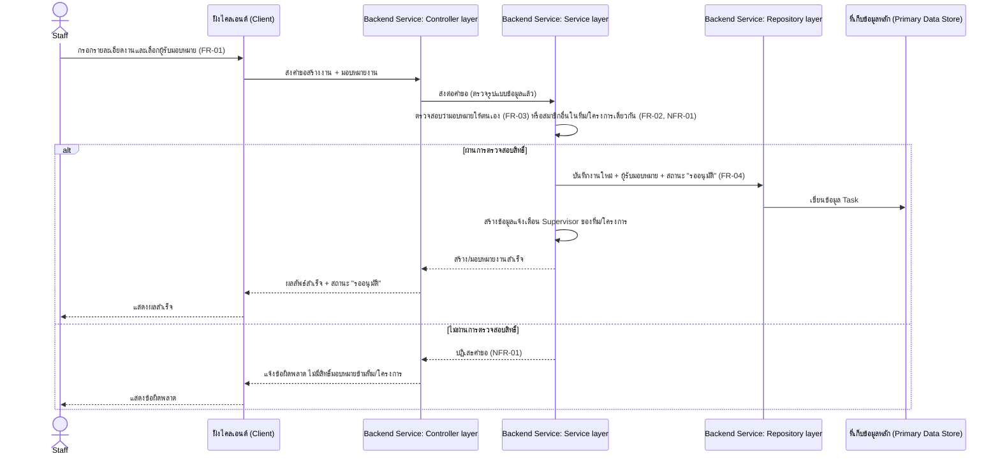
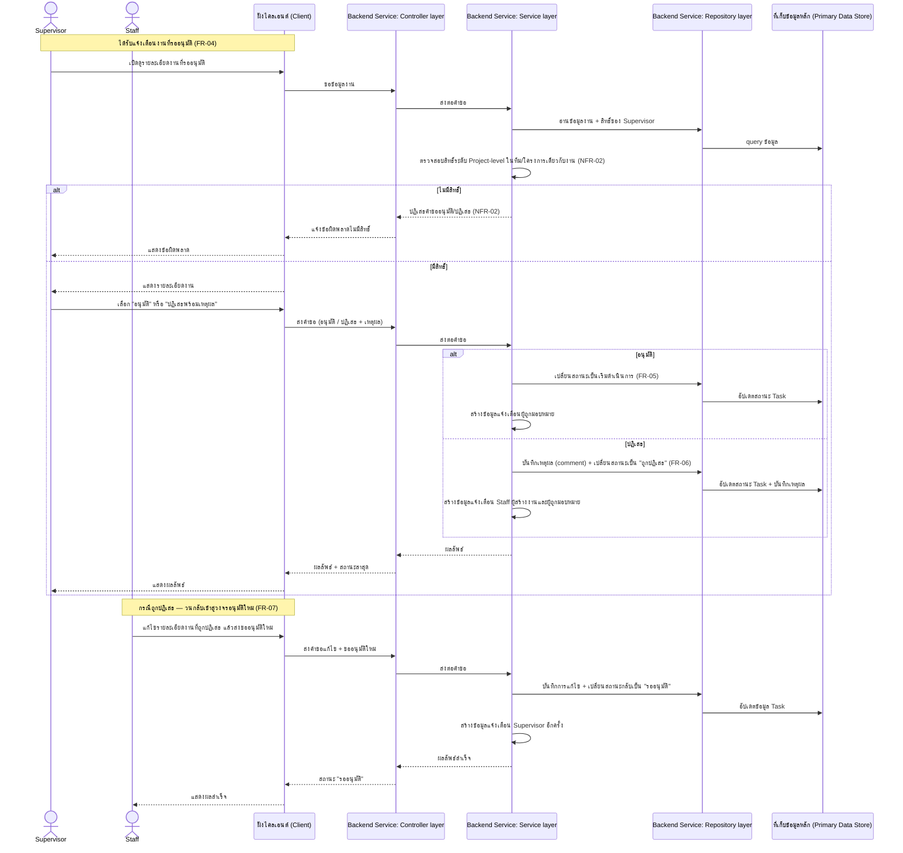

# Architecture (Hi-level / Logical)

เอกสารนี้อธิบายสถาปัตยกรรมระดับ logical/conceptual ของระบบ ครอบคลุมฟีเจอร์ทั้งหมดใน
[[feature-list]] และ journey ทั้งหมดใน [[user-journey]] อ้างอิงความต้องการต้นทางจาก [[backlog]]
และเอกสาร spec: [[20260815-01-task-creation-assignment]] (สร้างงาน/มอบหมายงาน) และ
[[20260815-02-supervisor-task-approval]] (อนุมัติ/ปฏิเสธงานโดย Supervisor)

## สถานะ technology-stack.md

ณ ปัจจุบัน [[technology-stack]] **ถูกตัดสินใจแล้ว** (มาตรฐานบังคับจาก CIO: Frontend อ้างอิง
`react-template-main`, Backend อ้างอิง `go-template-main` แบบ Clean Architecture layering
Controller → Service → Repository → Database) เอกสารนี้จึงยังคงเนื้อหาหลักเป็นระดับ
logical/conceptual ตามหน้าที่ของ architecture.md (ไม่ลง implementation/โค้ดจริง) แต่ระบุ
**การ map logical component เข้ากับชื่อ layer ของ Clean Architecture** ไว้ประกอบ เพื่อให้ผู้ทำ
detailed design ต่อยอดได้ง่ายขึ้น ส่วนรายละเอียด framework/version/module path ที่เจาะจงยังคงอยู่
ใน [[technology-stack]] เท่านั้น ตามที่เอกสารนั้นระบุไว้เองว่าการ map ระดับ module จริงควรเกิดขึ้น
ตอนเข้าสู่ detailed design

## ภาพรวม

ระบบประกอบด้วย 3 logical component หลัก ทำงานร่วมกันเพื่อรองรับฟีเจอร์ทั้งหมด (สร้างงาน/
มอบหมายงาน, อนุมัติ/ปฏิเสธงานโดย Supervisor, แก้ไขงานที่ถูกปฏิเสธและขออนุมัติใหม่):

1. **ฝั่งไคลเอนต์ (Client)** — หน้าจอผู้ใช้สำหรับ Staff และ Supervisor
2. **บริการฝั่งเซิร์ฟเวอร์ (Backend Service)** — รับผิดชอบ business logic, การตรวจสอบสิทธิ์,
   การจัดการ workflow สถานะงาน และการสร้างข้อมูลแจ้งเตือน ภายในแบ่งเป็น 3 ชั้นย่อยตาม Clean
   Architecture: Controller layer, Service layer, Repository layer
3. **ที่เก็บข้อมูลหลัก (Primary Data Store)** — เก็บข้อมูลงาน (Task), ผู้ใช้, ทีม/โครงการ,
   ประวัติสถานะ และเหตุผลการปฏิเสธ

## Component Diagram

## ขอบเขตความรับผิดชอบต่อ Component

| Component | ขอบเขตความรับผิดชอบ |
|-----------|------------------------|
| ฝั่งไคลเอนต์ (Client) | รับ input จากผู้ใช้ (ฟอร์มสร้างงาน, ฟอร์มมอบหมาย, หน้าจอ approve/reject, ฟอร์มแก้ไขงานที่ถูกปฏิเสธ); แสดงสถานะงานปัจจุบันและการแจ้งเตือนที่ได้รับจาก Backend Service; ส่งคำขอไปยัง Backend Service พร้อมข้อมูลยืนยันตัวตนของผู้ใช้ที่ล็อกอินอยู่ |
| บริการฝั่งเซิร์ฟเวอร์ (Backend Service) — Controller layer | รับคำขอจาก Client, ตรวจสอบรูปแบบข้อมูลนำเข้าเบื้องต้น, ส่งต่อให้ Service layer, แปลงผลลัพธ์กลับเป็นรูปแบบตอบกลับมาตรฐาน (ไม่ตัดสินใจเชิง business logic) |
| บริการฝั่งเซิร์ฟเวอร์ (Backend Service) — Service layer | Business logic หลักของทุกฟีเจอร์: สร้างงานพร้อมสถานะเริ่มต้น, ตรวจสอบสิทธิ์การมอบหมายงาน (NFR-01), ตรวจสอบสิทธิ์การอนุมัติ/ปฏิเสธของ Supervisor (NFR-02), ควบคุม workflow เปลี่ยนสถานะงาน (รออนุมัติ → เริ่มดำเนินการ / ถูกปฏิเสธ → รออนุมัติอีกครั้ง), สร้างข้อมูลแจ้งเตือนเมื่อสถานะเปลี่ยน |
| บริการฝั่งเซิร์ฟเวอร์ (Backend Service) — Repository layer | เป็น interface เข้าถึงข้อมูลใน Primary Data Store ให้ Service layer ใช้งานโดยไม่ต้องรู้รายละเอียดการจัดเก็บจริง |
| ที่เก็บข้อมูลหลัก (Primary Data Store) | จัดเก็บข้อมูล Task (ชื่อ, รายละเอียด, ผู้รับมอบหมาย, กำหนดส่ง, ระดับความสำคัญ, สถานะ), ข้อมูลผู้ใช้และการสังกัดทีม/โครงการ, ประวัติสถานะ/เหตุผลการปฏิเสธ (comment ผูกกับ Task) |

## Data Flow Diagram

### Journey: สร้างงานใหม่และมอบหมายงานให้ทีม (FR-01–03, NFR-01, ต่อยอดไปยัง FR-04)

อ้างอิง [[user-journey#Journey: Staff สร้างงานใหม่และมอบหมายงานให้ทีม]]

### Journey: Supervisor ตรวจสอบและอนุมัติ/ปฏิเสธงาน (FR-04–07, NFR-02)

อ้างอิง [[user-journey#Journey: Supervisor ตรวจสอบและอนุมัติ/ปฏิเสธงาน]]

## NFR Mapping

| รหัส NFR | คำอธิบายสั้น | Component ที่รับผิดชอบหลัก | แนวทางเชิงหลักการ |
|----------|--------------|------------------------------|----------------------|
| NFR-01 | Authorization การมอบหมายงาน: อนุญาตเฉพาะสมาชิกในทีม/โครงการเดียวกัน หรือ self-assign | Backend Service — Service layer | ทุกคำขอมอบหมายงานต้องตรวจสอบว่าผู้รับมอบหมายสังกัดทีม/โครงการเดียวกับผู้สร้างงานก่อนบันทึกเสมอ ไม่เชื่อค่าที่ Client ส่งมาโดยตรง ปฏิเสธคำขอทันทีหากไม่ผ่านการตรวจสอบ |
| NFR-02 | Authorization การอนุมัติ/ปฏิเสธงาน: อนุญาตเฉพาะ Supervisor ระดับ Project-level ในทีม/โครงการเดียวกับงานนั้น | Backend Service — Service layer | ทุกคำขออนุมัติ/ปฏิเสธต้องตรวจสอบ role (Supervisor) และ scope (ทีม/โครงการเดียวกับงาน) ก่อนอนุญาตให้เปลี่ยนสถานะงานทุกครั้ง ปฏิเสธคำขอทันทีหากไม่ผ่านการตรวจสอบ ไม่ว่าจะเรียกผ่านช่องทางใด |

หมายเหตุ: การตรวจสอบตัวตนผู้ใช้ (authentication) เป็นกลไกพื้นฐานที่ Controller layer ต้องมีอยู่แล้ว
ก่อนคำขอจะไปถึง Service layer แต่การตรวจสอบสิทธิ์เชิง business rule ตาม NFR-01/NFR-02 (ขอบเขต
ทีม/โครงการ, บทบาท Project-level) เป็นความรับผิดชอบของ Service layer เนื่องจากต้องอาศัยข้อมูล
ความสัมพันธ์ระหว่าง user–team/project–task ซึ่งเป็น business logic ไม่ใช่แค่การยืนยันตัวตน

## ประเด็นรอตัดสินใจ

รายละเอียดต่อไปนี้ยังไม่ควรถูกกำหนดในเอกสารระดับ hi-level นี้ ให้ดูการตัดสินใจจริงหรือพิจารณาต่อใน
`detailed-design/` และเอกสารที่เกี่ยวข้อง:

- **ช่องทางแจ้งเตือน (notification delivery channel):** สเปกระบุเพียงว่าต้อง "แจ้งเตือน" Supervisor/
  Staff/ผู้ถูกมอบหมาย (FR-04, FR-05, FR-06, FR-07) แต่ยังไม่ระบุว่าเป็นการแจ้งเตือนภายในระบบ
  (in-app), อีเมล, หรือช่องทางอื่น — เป็นรายละเอียด implementation ที่ควรตัดสินใจตอน detailed
  design ต่อฟีเจอร์ ไม่กระทบ logical component ที่ระบุไว้ในเอกสารนี้ (ยังคงอยู่ใน Service layer
  ของ Backend Service)
- **การ map component → module/layer จริงตาม [[technology-stack]]:** แม้เอกสารนี้ระบุ mapping
  ระดับ Clean Architecture layer (Controller/Service/Repository) ไว้แล้วตามที่ [[technology-stack]]
  กำหนดเป็นมาตรฐานบังคับ แต่การ map เข้ากับโครงสร้างโมดูล/ไฟล์จริง (เช่น `src/pages`, `src/services`
  ฝั่ง Client หรือ package จริงฝั่ง Backend) เป็นงานของ detailed design ต่อฟีเจอร์ ไม่ใช่ของเอกสารนี้
- **Database engine ที่ใช้จริง:** [[technology-stack]] รองรับ 4 ตัวเลือก (PostgreSQL/MSSQL/Oracle/
  Tarantool) ยังไม่ได้เลือกเจาะจงสำหรับโปรเจกต์นี้ — จุดนี้เป็นของ [[db-spec]] ไม่ใช่ของ
  architecture.md

## เอกสารที่เกี่ยวข้อง

- [[feature-list]]
- [[user-journey]]
- [[backlog]]
- [[technology-stack]]
- [[20260815-01-task-creation-assignment]]
- [[20260815-02-supervisor-task-approval]]
