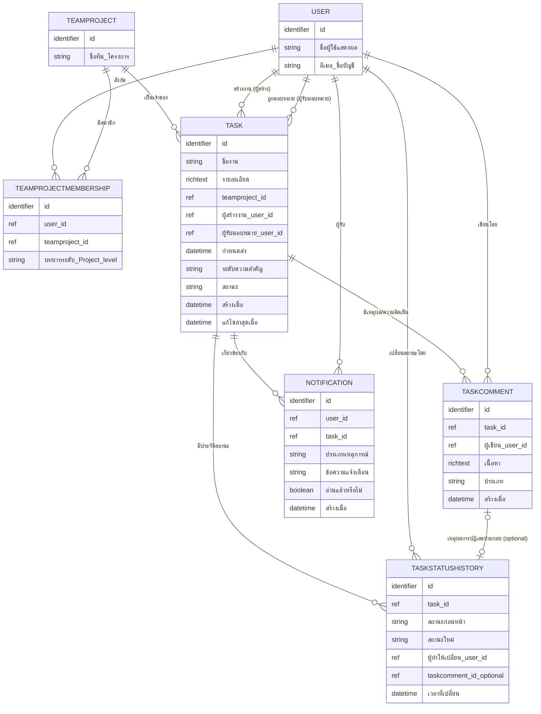

# DB Spec (Logical / Entity-Attribute-Relationship)

เอกสารนี้อธิบายโมเดลข้อมูลระดับ logical (entity, attribute, ความสัมพันธ์) ของระบบ ครอบคลุม
ฟีเจอร์ทั้งหมดใน [[feature-list]] และ [[user-journey]] สอดคล้องกับ [[architecture]]
(ที่เก็บข้อมูลหลัก / Primary Data Store) อ้างอิงความต้องการต้นทางจาก [[backlog]] และเอกสาร spec:
[[20260815-01-task-creation-assignment]] (สร้างงาน/มอบหมายงาน) และ
[[20260815-02-supervisor-task-approval]] (อนุมัติ/ปฏิเสธงานโดย Supervisor)

**หมายเหตุเรื่อง tech stack:** เอกสารนี้ใช้ชนิดข้อมูลเชิงตรรกะเท่านั้น (ข้อความ, ตัวเลข,
วันที่-เวลา, จริง/เท็จ, อ้างอิงถึง Entity อื่น) **ไม่ระบุ SQL type และไม่ระบุชื่อ database engine
เจาะจง** แม้ [[technology-stack]] จะตัดสินใจแล้วว่า Backend รองรับ 4 database engine ทางเลือก
(PostgreSQL/MSSQL/Oracle/Tarantool) ก็ตาม เนื่องจาก[[technology-stack]]เองระบุไว้ว่าการ**เลือก
engine ที่ใช้จริง**สำหรับโปรเจกต์นี้ยังไม่เกิดขึ้น จึงเป็นประเด็นที่ต้องรอตัดสินใจ (ดูหัวข้อ
"ประเด็นรอตัดสินใจ" ท้ายเอกสาร) ไม่ใช่สิ่งที่ควร assume ในเอกสารระดับ logical นี้

## Entity ทั้งหมด

### 1. User (ผู้ใช้)

| Attribute | ชนิดข้อมูลเชิงตรรกะ | จำเป็นต้องมีค่า | หมายเหตุ |
|-----------|----------------------|------------------|----------|
| id | ตัวระบุ (identifier) | ใช่ | คีย์หลัก |
| ชื่อผู้ใช้แสดงผล | ข้อความ | ใช่ | |
| อีเมล/ชื่อบัญชีสำหรับเข้าสู่ระบบ | ข้อความ | ใช่ | ต้องไม่ซ้ำกันในระบบ |

หมายเหตุ: บทบาท/สิทธิ์ระดับ Project-level (Staff/Supervisor) ไม่ใช่ attribute ของ User โดยตรง
เพราะผู้ใช้คนเดียวอาจมีบทบาทต่างกันในแต่ละทีม/โครงการ (ตามที่
[[20260815-02-supervisor-task-approval]] ระบุว่าเป็น "รูปแบบสิทธิ์ 2 ระดับของระบบ คือ
System-level และ Project-level แบบ union ของหลายบทบาท") — จึงเก็บผ่าน entity
**TeamProjectMembership** แทน

### 2. TeamProject (ทีม/โครงการ)

| Attribute | ชนิดข้อมูลเชิงตรรกะ | จำเป็นต้องมีค่า | หมายเหตุ |
|-----------|----------------------|------------------|----------|
| id | ตัวระบุ (identifier) | ใช่ | คีย์หลัก |
| ชื่อทีม/โครงการ | ข้อความ | ใช่ | |

### 3. TeamProjectMembership (การสังกัดทีม/โครงการ + บทบาทระดับ Project-level)

| Attribute | ชนิดข้อมูลเชิงตรรกะ | จำเป็นต้องมีค่า | หมายเหตุ |
|-----------|----------------------|------------------|----------|
| id | ตัวระบุ (identifier) | ใช่ | คีย์หลัก |
| อ้างอิงถึง User | อ้างอิงถึง Entity อื่น (User) | ใช่ | ผู้ใช้ที่สังกัด |
| อ้างอิงถึง TeamProject | อ้างอิงถึง Entity อื่น (TeamProject) | ใช่ | ทีม/โครงการที่สังกัด |
| บทบาทระดับ Project-level | ข้อความ (ค่าที่เป็นไปได้: Staff, Supervisor) | ใช่ | ใช้ตรวจสอบ NFR-01 (ขอบเขตทีม/โครงการเดียวกัน) และ NFR-02 (สิทธิ์ระดับ Supervisor) |

Business rule ที่กระทบโครงสร้าง: ผู้ใช้หนึ่งคนมีได้หลาย TeamProjectMembership (หลายทีม/โครงการ
และ/หรือหลายบทบาท) → ความสัมพันธ์ User – TeamProject เป็นแบบ **N:M** ผ่าน entity นี้

### 4. Task (งาน)

| Attribute | ชนิดข้อมูลเชิงตรรกะ | จำเป็นต้องมีค่า | หมายเหตุ |
|-----------|----------------------|------------------|----------|
| id | ตัวระบุ (identifier) | ใช่ | คีย์หลัก |
| ชื่องาน | ข้อความ | ใช่ | FR-01 |
| รายละเอียด | ข้อความสมบูรณ์แบบ (Rich Text) | ใช่ | FR-01 — จัดเก็บเป็น Rich Text ตามที่สเปกระบุ แยกจาก Project Doc/Wiki (Markdown ผูก Git) |
| อ้างอิงถึง TeamProject | อ้างอิงถึง Entity อื่น (TeamProject) | ใช่ | ทีม/โครงการที่งานนี้สังกัด ใช้เป็น scope หลักในการตรวจสอบ NFR-01/NFR-02 |
| อ้างอิงถึง User (ผู้สร้างงาน) | อ้างอิงถึง Entity อื่น (User) | ใช่ | FR-01 |
| อ้างอิงถึง User (ผู้รับมอบหมายปัจจุบัน) | อ้างอิงถึง Entity อื่น (User) | ใช่ | FR-01, FR-02, FR-03 — อาจเป็นคนเดียวกับผู้สร้างงานกรณี self-assign (FR-03) |
| กำหนดส่ง (Due Date) | วันที่-เวลา | ใช่ | FR-01 |
| ระดับความสำคัญ (Priority) | ข้อความ (ค่าที่กำหนดไว้ล่วงหน้า เช่น สูง/กลาง/ต่ำ) | ใช่ | FR-01 |
| สถานะ | ข้อความ (ค่าที่เป็นไปได้: รอดำเนินการ, รออนุมัติ, ถูกปฏิเสธ) | ใช่ | FR-01 (สถานะเริ่มต้น), FR-04 ("รออนุมัติ"), FR-05 (เปลี่ยนเป็นสถานะเริ่มดำเนินการ), FR-06 ("ถูกปฏิเสธ"), FR-07 (กลับเป็น "รออนุมัติ") |
| สร้างเมื่อ | วันที่-เวลา | ใช่ | audit |
| แก้ไขล่าสุดเมื่อ | วันที่-เวลา | ใช่ | audit — อัปเดตทุกครั้งที่มีการแก้ไขงาน (เช่น FR-07) |

Business rule ที่กระทบโครงสร้างข้อมูล:
- **ทีม/โครงการของผู้รับมอบหมายต้องตรงกับทีม/โครงการของ Task** (ผ่าน TeamProjectMembership) —
  ตรวจสอบทุกครั้งที่สร้าง/มอบหมายงาน (FR-02, NFR-01) ยกเว้น self-assign (FR-03) ที่อนุญาตเสมอ
  เพราะผู้สร้างงานย่อมสังกัดทีม/โครงการเดียวกับงานอยู่แล้ว
- **ทีม/โครงการของ Supervisor ที่อนุมัติ/ปฏิเสธต้องตรงกับทีม/โครงการของ Task** (NFR-02) —
  ตรวจสอบผ่าน TeamProjectMembership ที่มีบทบาท Supervisor ในทีม/โครงการเดียวกัน
- สถานะของ Task เปลี่ยนแบบมีลำดับ (workflow) เท่านั้น: รออนุมัติ → รอดำเนินการ (อนุมัติ) หรือ
  รออนุมัติ → ถูกปฏิเสธ (ปฏิเสธ) → รออนุมัติ (แก้ไขส่งใหม่ ตาม FR-07) — ไม่มี attribute ใดเก็บ
  ลำดับนี้ตรงๆ แต่ถูกบังคับใช้เป็น business rule ในชั้น Service layer ([[architecture]])
  ประกอบกับ TaskStatusHistory ด้านล่างที่บันทึกร่องรอยการเปลี่ยนสถานะจริง

### 5. TaskComment (เหตุผล/ความคิดเห็นผูกกับ Task)

| Attribute | ชนิดข้อมูลเชิงตรรกะ | จำเป็นต้องมีค่า | หมายเหตุ |
|-----------|----------------------|------------------|----------|
| id | ตัวระบุ (identifier) | ใช่ | คีย์หลัก |
| อ้างอิงถึง Task | อ้างอิงถึง Entity อื่น (Task) | ใช่ | |
| อ้างอิงถึง User (ผู้เขียน) | อ้างอิงถึง Entity อื่น (User) | ใช่ | |
| เนื้อหา | ข้อความสมบูรณ์แบบ (Rich Text) | ใช่ | FR-06 — เหตุผลการปฏิเสธ บันทึกเป็น Rich Text/comment ผูกกับ Task ตามที่สเปกระบุ |
| ประเภท comment | ข้อความ (ค่าที่เป็นไปได้: เหตุผลการปฏิเสธ) | ใช่ | ปัจจุบันมีเพียงประเภทเดียวตามขอบเขต FR-06 เผื่อขยายประเภทอื่นในอนาคต |
| สร้างเมื่อ | วันที่-เวลา | ใช่ | |

### 6. TaskStatusHistory (ประวัติการเปลี่ยนสถานะ)

| Attribute | ชนิดข้อมูลเชิงตรรกะ | จำเป็นต้องมีค่า | หมายเหตุ |
|-----------|----------------------|------------------|----------|
| id | ตัวระบุ (identifier) | ใช่ | คีย์หลัก |
| อ้างอิงถึง Task | อ้างอิงถึง Entity อื่น (Task) | ใช่ | |
| สถานะก่อนหน้า | ข้อความ | ใช่ | |
| สถานะใหม่ | ข้อความ | ใช่ | |
| อ้างอิงถึง User (ผู้ทำให้เกิดการเปลี่ยนสถานะ) | อ้างอิงถึง Entity อื่น (User) | ใช่ | Staff (มอบหมาย/แก้ไขส่งใหม่) หรือ Supervisor (อนุมัติ/ปฏิเสธ) |
| อ้างอิงถึง TaskComment | อ้างอิงถึง Entity อื่น (TaskComment) | ไม่ใช่ (optional) | ผูกเฉพาะกรณีเปลี่ยนสถานะเป็น "ถูกปฏิเสธ" (FR-06) ที่ต้องมีเหตุผลประกอบ |
| เวลาที่เปลี่ยนสถานะ | วันที่-เวลา | ใช่ | |

Business rule ที่กระทบโครงสร้าง: entity นี้เก็บ audit trail ของ workflow ทั้งหมด (FR-04–FR-07)
แยกจาก attribute สถานะปัจจุบันใน Task เพื่อไม่ให้ประวัติหายเมื่อสถานะเปลี่ยนซ้ำ (เช่น กรณีวนกลับ
รออนุมัติหลายรอบตาม FR-07)

### 7. Notification (ข้อมูลแจ้งเตือน)

| Attribute | ชนิดข้อมูลเชิงตรรกะ | จำเป็นต้องมีค่า | หมายเหตุ |
|-----------|----------------------|------------------|----------|
| id | ตัวระบุ (identifier) | ใช่ | คีย์หลัก |
| อ้างอิงถึง User (ผู้รับแจ้งเตือน) | อ้างอิงถึง Entity อื่น (User) | ใช่ | |
| อ้างอิงถึง Task | อ้างอิงถึง Entity อื่น (Task) | ใช่ | เหตุการณ์แจ้งเตือนทั้งหมดในขอบเขตนี้ผูกกับ Task เสมอ |
| ประเภทเหตุการณ์ | ข้อความ (ค่าที่เป็นไปได้: งานรออนุมัติ, งานได้รับอนุมัติ, งานถูกปฏิเสธ, ส่งขออนุมัติใหม่) | ใช่ | FR-04, FR-05, FR-06, FR-07 |
| ข้อความแจ้งเตือน | ข้อความ | ใช่ | |
| อ่านแล้วหรือไม่ | จริง/เท็จ | ใช่ | ค่าเริ่มต้นเป็นเท็จเมื่อสร้าง |
| สร้างเมื่อ | วันที่-เวลา | ใช่ | |

หมายเหตุ: ช่องทางการนำส่งแจ้งเตือนจริง (in-app/อีเมล/อื่นๆ) ยังไม่ตัดสินใจ (ดู "ประเด็นรอตัดสินใจ"
ใน [[architecture]]) เอกสารนี้กำหนดเฉพาะโครงสร้างข้อมูลเชิง logical ของสิ่งที่ต้องถูกบันทึกไว้เพื่อ
รองรับการแจ้งเตือน ไม่ผูกกับกลไกนำส่งจริง

## ความสัมพันธ์ (Cardinality สรุป)

| ความสัมพันธ์ | Cardinality | อ้างอิง |
|---------------|-------------|---------|
| User – TeamProject (ผ่าน TeamProjectMembership) | N:M | ผู้ใช้หนึ่งคนสังกัดได้หลายทีม/โครงการ พร้อมบทบาทต่างกันในแต่ละทีม |
| TeamProject – Task | 1:N | หนึ่งทีม/โครงการมีได้หลายงาน |
| User (ผู้สร้างงาน) – Task | 1:N | ผู้ใช้หนึ่งคนสร้างได้หลายงาน |
| User (ผู้รับมอบหมาย) – Task | 1:N | ผู้ใช้หนึ่งคนถูกมอบหมายได้หลายงาน (ที่เวลาหนึ่งงานมีผู้รับมอบหมายเดียว) |
| Task – TaskComment | 1:N | หนึ่งงานมีได้หลาย comment (เหตุผลปฏิเสธหลายรอบตาม FR-07) |
| User (ผู้เขียน) – TaskComment | 1:N | |
| Task – TaskStatusHistory | 1:N | |
| User (ผู้ทำให้เปลี่ยนสถานะ) – TaskStatusHistory | 1:N | |
| TaskComment – TaskStatusHistory | 1:0..1 | ประวัติการปฏิเสธหนึ่งรายการผูกกับเหตุผลหนึ่งรายการ (optional) |
| Task – Notification | 1:N | |
| User (ผู้รับ) – Notification | 1:N | |

## ER Diagram

## ประเด็นรอตัดสินใจ

รายละเอียดต่อไปนี้ยังไม่ควรถูกกำหนดในเอกสารระดับ logical นี้ ให้ดูการตัดสินใจจริงตอน
implementation/detailed design โดยอ้างอิง [[technology-stack]]:

- **Database engine ที่ใช้จริง:** [[technology-stack]] รองรับ 4 ตัวเลือก (PostgreSQL/MSSQL/Oracle/
  Tarantool) ผ่าน repository facade + strategy pattern แต่ยังไม่เลือกเจาะจงสำหรับโปรเจกต์นี้ —
  entity/attribute ในเอกสารนี้ต้อง map เป็นตาราง/collection จริงตอนเลือก engine แล้วเท่านั้น
- **ชนิดข้อมูลจริงระดับ column/field:** เช่นความยาวสูงสุดของข้อความ, ความละเอียดของวันที่-เวลา,
  การเข้ารหัส Rich Text (HTML/JSON/Delta ฯลฯ) เป็นรายละเอียด detailed design ต่อฟีเจอร์
- **ช่องทางนำส่งการแจ้งเตือนจริง (Notification delivery):** ดูหัวข้อ "ประเด็นรอตัดสินใจ" ใน
  [[architecture]] — entity `Notification` ในเอกสารนี้ระบุเฉพาะข้อมูลที่ต้องถูกบันทึก ไม่ผูกกับ
  กลไกนำส่งจริง

## เอกสารที่เกี่ยวข้อง

- [[architecture]]
- [[api-spec]]
- [[feature-list]]
- [[user-journey]]
- [[backlog]]
- [[technology-stack]]
- [[20260815-01-task-creation-assignment]]
- [[20260815-02-supervisor-task-approval]]
