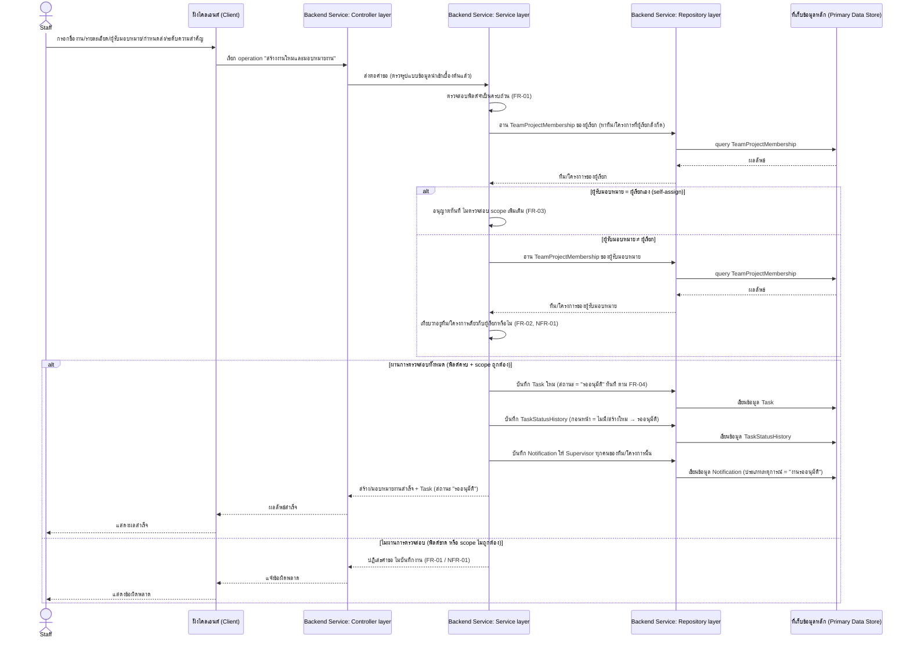
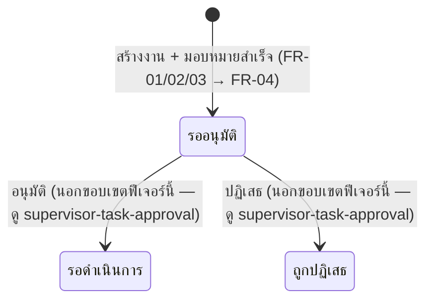

# Detailed Design: สร้างงานใหม่และมอบหมายงานให้ทีม

เอกสารนี้อธิบายการออกแบบระดับ component ของฟีเจอร์
[[feature-list#1. สร้างงานใหม่และมอบหมายงานให้ทีม|สร้างงานใหม่และมอบหมายงานให้ทีม]] แปลงจาก
[[user-journey#Journey: Staff สร้างงานใหม่และมอบหมายงานให้ทีม]] เป็นลำดับการเรียก operation จริง
ตาม [[api-spec]] และผลกระทบต่อ entity ตาม [[db-spec]] อ้างอิง component จาก [[architecture]]
(Client / Backend Service: Controller–Service–Repository layer / Primary Data Store)

รหัส FR/NFR ที่ครอบคลุม:
[[20260815-01-task-creation-assignment#Functional Requirements (FR)|FR-01]],
[[20260815-01-task-creation-assignment#Functional Requirements (FR)|FR-02]],
[[20260815-01-task-creation-assignment#Functional Requirements (FR)|FR-03]],
[[20260815-01-task-creation-assignment#Non-Functional Requirements (NFR)|NFR-01]], ต่อยอดไปยัง
[[20260815-02-supervisor-task-approval#Functional Requirements (FR)|FR-04]] (การตั้งสถานะ
"รออนุมัติ" อัตโนมัติ อยู่ใน operation เดียวกัน)

## Sequence Diagram

ใช้ operation เดียวจาก [[api-spec]]: [[api-spec#1. สร้างงานใหม่และมอบหมายงาน|1. สร้างงานใหม่และ
มอบหมายงาน]] (การสร้างงานและการมอบหมายงานผูกกันเป็นคำขอเดียวเสมอตามสเปกต้นทาง — ไม่มี operation
แยกสำหรับ "สร้าง" กับ "มอบหมาย")

## Operation ↔ Entity ที่กระทบ

| ลำดับ | Operation ([[api-spec]]) | Entity ที่กระทบ ([[db-spec]]) | การกระทำ | หมายเหตุลำดับก่อน-หลัง |
|-------|---------------------------|----------------------------------|----------|---------------------------|
| 1 | [[api-spec#1. สร้างงานใหม่และมอบหมายงาน\|1. สร้างงานใหม่และมอบหมายงาน]] | `TeamProjectMembership` | อ่าน (ของผู้เรียกและผู้รับมอบหมาย ถ้าไม่ใช่ self-assign) | ต้องอ่านก่อนตัดสินใจว่าจะบันทึก Task ได้หรือไม่ |
| 2 | เดียวกัน | `Task` | สร้างใหม่ (สถานะเริ่มต้น = "รออนุมัติ") | ต้องบันทึก Task สำเร็จก่อนจึงบันทึก TaskStatusHistory/Notification ที่อ้างอิงถึง Task นั้นได้ |
| 3 | เดียวกัน | `TaskStatusHistory` | สร้างใหม่ (สถานะก่อนหน้า = ไม่มี → "รออนุมัติ") | เกิดหลัง Task ถูกสร้างสำเร็จ ในธุรกรรมเดียวกัน |
| 4 | เดียวกัน | `Notification` | สร้างใหม่ (หนึ่งรายการต่อ Supervisor หนึ่งคนของทีม/โครงการนั้น) | เกิดหลัง Task ถูกสร้างสำเร็จ ต้องรู้ก่อนว่า Supervisor คนใดบ้างสังกัดทีม/โครงการเดียวกัน (อ่านจาก `TeamProjectMembership`) |

## State Diagram (สถานะของ Task)

ฟีเจอร์นี้ครอบคลุมเฉพาะ transition แรกของ workflow (สร้างงาน → "รออนุมัติ") ส่วน transition ถัดไป
(รออนุมัติ → รอดำเนินการ / ถูกปฏิเสธ) เป็นของฟีเจอร์
[[supervisor-task-approval|อนุมัติ/ปฏิเสธงานโดย Supervisor]] — แสดงไว้แบบจางเพื่อบริบทเท่านั้น

## Edge Case และวิธีจัดการ

อ้างอิง [[acceptance-criteria#1. สร้างงานใหม่และมอบหมายงานให้ทีม]] และ
[[test-cases/create-assign-task|test-cases: create-assign-task]] (TC-01-01–TC-01-07)

| Edge Case | วิธีจัดการ | อ้างอิง |
|-----------|------------|---------|
| ฟิลด์จำเป็นขาดหาย (เช่น ไม่ระบุกำหนดส่ง/ระดับความสำคัญ) | Service layer ตรวจสอบครบทุกฟิลด์จำเป็นก่อนบันทึก ปฏิเสธคำขอทั้งหมด ไม่สร้าง Task ถ้าขาดฟิลด์ใด | FR-01, TC-01-02 |
| รูปแบบข้อมูลไม่ถูกต้อง (เช่น กำหนดส่งไม่ใช่วันที่ที่ถูกต้อง) | ปฏิเสธคำขอ ไม่สร้างงาน แจ้งข้อผิดพลาดของรูปแบบข้อมูล | FR-01, TC-01-03 |
| มอบหมายงานข้ามทีม/โครงการ (ผู้รับมอบหมายไม่ได้สังกัดทีม/โครงการเดียวกับผู้เรียก) | Service layer ตรวจสอบ `TeamProjectMembership` ของผู้รับมอบหมายเทียบกับผู้เรียกทุกครั้งก่อนบันทึก ปฏิเสธคำขอทั้งหมดถ้าไม่ตรงกัน ไม่มีข้อยกเว้นไม่ว่าจะเรียกผ่านช่องทางใด | FR-02, NFR-01, TC-01-05, TC-01-06 |
| มอบหมายงานให้ตนเอง (self-assign) | อนุญาตเสมอ ไม่ต้องผ่านการตรวจสอบ scope ทีม/โครงการเพิ่มเติม เพราะผู้สร้างงานย่อมสังกัดทีม/โครงการเดียวกับงานอยู่แล้ว | FR-03, TC-01-04 |
| ผู้ใช้พยายามส่งค่าทีม/โครงการของ Task มาเองจาก Client โดยตรง | Service layer ไม่รับค่าทีม/โครงการจาก input ของผู้เรียกเลย กำหนดจาก `TeamProjectMembership` ของผู้เรียกเสมอ ป้องกันการปลอมค่าจาก Client | NFR-01, TC-01-07 |

## เอกสารที่เกี่ยวข้อง

- [[api-spec]]
- [[db-spec]]
- [[architecture]]
- [[feature-list]]
- [[user-journey]]
- [[acceptance-criteria]]
- [[test-cases/create-assign-task]]
- [[20260815-01-task-creation-assignment]]
- [[20260815-02-supervisor-task-approval]]
