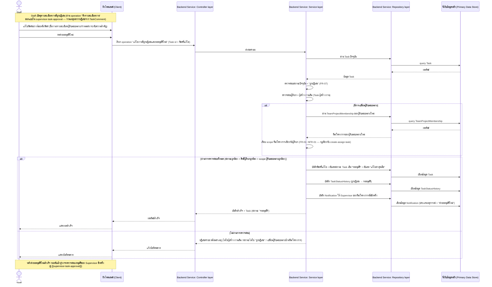
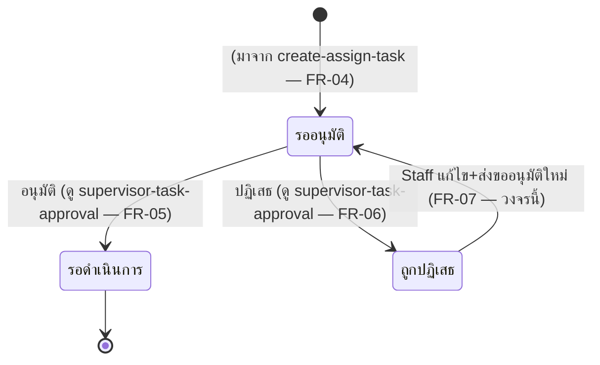

# Detailed Design: แก้ไขงานที่ถูกปฏิเสธและขออนุมัติใหม่

เอกสารนี้อธิบายการออกแบบระดับ component ของฟีเจอร์
[[feature-list#3. แก้ไขงานที่ถูกปฏิเสธและขออนุมัติใหม่|แก้ไขงานที่ถูกปฏิเสธและขออนุมัติใหม่]] แปลง
จาก [[user-journey#Journey: Supervisor ตรวจสอบและอนุมัติ/ปฏิเสธงาน]] (ขั้นตอนที่ 6 — วงจรกลับหลัง
ถูกปฏิเสธ) เป็นลำดับการเรียก operation จริงตาม [[api-spec]] และผลกระทบต่อ entity ตาม [[db-spec]]
อ้างอิง component จาก [[architecture]] (Client / Backend Service: Controller–Service–Repository
layer / Primary Data Store)

รหัส FR/NFR ที่ครอบคลุม:
[[20260815-02-supervisor-task-approval#Functional Requirements (FR)|FR-07]] (อ้างอิงกฎเดียวกับ
[[20260815-01-task-creation-assignment#Functional Requirements (FR)|FR-02]]/
[[20260815-01-task-creation-assignment#Non-Functional Requirements (NFR)|NFR-01]] กรณีมีการเปลี่ยน
ผู้รับมอบหมายระหว่างแก้ไข)

## Sequence Diagram

ใช้ operation เดียวจาก [[api-spec]]:
[[api-spec#6. แก้ไขงานที่ถูกปฏิเสธและขออนุมัติใหม่|6. แก้ไขงานที่ถูกปฏิเสธและขออนุมัติใหม่]]

## Operation ↔ Entity ที่กระทบ

| ลำดับ | Operation ([[api-spec]]) | Entity ที่กระทบ ([[db-spec]]) | การกระทำ | หมายเหตุลำดับก่อน-หลัง |
|-------|---------------------------|----------------------------------|----------|---------------------------|
| 1 | [[api-spec#6. แก้ไขงานที่ถูกปฏิเสธและขออนุมัติใหม่\|6. แก้ไขงานที่ถูกปฏิเสธและขออนุมัติใหม่]] | `Task` | อ่าน (ตรวจสอบสถานะปัจจุบัน + ผู้สร้างงาน) | ต้องอ่านก่อนเสมอเพื่อยืนยันสถานะ = "ถูกปฏิเสธ" และผู้เรียกเป็นผู้สร้างงานเดิม |
| 2 | เดียวกัน (เฉพาะกรณีเปลี่ยนผู้รับมอบหมาย) | `TeamProjectMembership` | อ่าน (ของผู้รับมอบหมายใหม่) | ต้องอ่านก่อนตัดสินใจว่าจะบันทึกการแก้ไขได้หรือไม่ ใช้กฎเดียวกับ [[create-assign-task]] |
| 3 | เดียวกัน | `Task` | แก้ไข (ฟิลด์ที่เปลี่ยน + สถานะ: "ถูกปฏิเสธ" → "รออนุมัติ" + แก้ไขล่าสุดเมื่อ) | ต้องผ่านการตรวจสอบข้อ 1–2 ก่อนแก้ไขเสมอ |
| 4 | เดียวกัน | `TaskStatusHistory` | สร้างใหม่ (สถานะก่อนหน้า = "ถูกปฏิเสธ" → สถานะใหม่ = "รออนุมัติ") | เกิดหลัง Task อัปเดตสำเร็จ ในธุรกรรมเดียวกัน |
| 5 | เดียวกัน | `Notification` | สร้างใหม่ (ให้ Supervisor ของทีม/โครงการนั้นอีกครั้ง) | เกิดหลัง Task อัปเดตสำเร็จ |

## State Diagram (สถานะของ Task)

ครอบคลุม transition ที่ 3 ของ workflow: "ถูกปฏิเสธ" → "รออนุมัติ" (วนกลับเข้าสู่วงจรตรวจสอบของ
Supervisor ใน [[supervisor-task-approval]] อีกครั้ง จนกว่าจะได้รับการอนุมัติ)

## Edge Case และวิธีจัดการ

อ้างอิง [[acceptance-criteria#3. แก้ไขงานที่ถูกปฏิเสธและขออนุมัติใหม่]] และ
[[test-cases/resubmit-rejected-task|test-cases: resubmit-rejected-task]] (TC-03-01–TC-03-04)

| Edge Case | วิธีจัดการ | อ้างอิง |
|-----------|------------|---------|
| ผู้เรียกไม่ใช่ผู้สร้างงานเดิม (เช่น ผู้ถูกมอบหมายที่ไม่ใช่ผู้สร้าง) | Service layer ตรวจสอบ `Task.ผู้สร้างงาน` ตรงกับผู้เรียกก่อนอนุญาตให้แก้ไข ปฏิเสธคำขอถ้าไม่ตรงกัน | FR-07, TC-03-02 |
| งานไม่ได้อยู่ในสถานะ "ถูกปฏิเสธ" (เช่น ยังรออนุมัติอยู่ หรืออนุมัติไปแล้ว) | ตรวจสอบสถานะปัจจุบันก่อนแก้ไขเสมอ ปฏิเสธคำขอพร้อมแจ้งสถานะปัจจุบัน ไม่แก้ไขข้อมูล | FR-07, TC-03-03 |
| เปลี่ยนผู้รับมอบหมายเป็นผู้ที่ไม่ได้อยู่ในทีม/โครงการเดียวกัน | ใช้กฎการตรวจสอบ scope เดียวกับการมอบหมายงานครั้งแรก (`TeamProjectMembership`) ปฏิเสธคำขอทั้งหมด ไม่เปลี่ยนสถานะงาน (ยังคงเป็น "ถูกปฏิเสธ") | FR-02, NFR-01, TC-03-04 |
| ไม่พบ Task ตาม id ที่ระบุ | แจ้งไม่พบข้อมูล ไม่ดำเนินการต่อ | FR-07 (กรณี error หลัก) |

## เอกสารที่เกี่ยวข้อง

- [[api-spec]]
- [[db-spec]]
- [[architecture]]
- [[feature-list]]
- [[user-journey]]
- [[acceptance-criteria]]
- [[test-cases/resubmit-rejected-task]]
- [[create-assign-task]]
- [[supervisor-task-approval]]
- [[20260815-02-supervisor-task-approval]]
