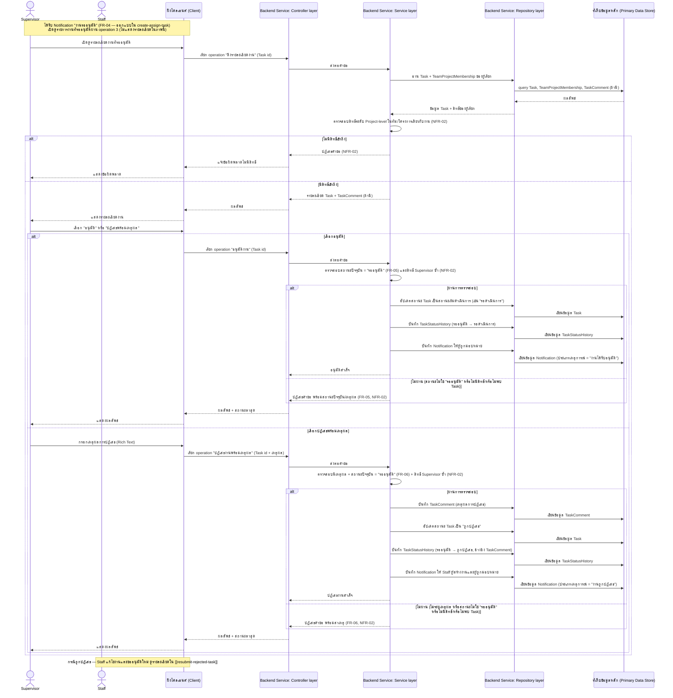
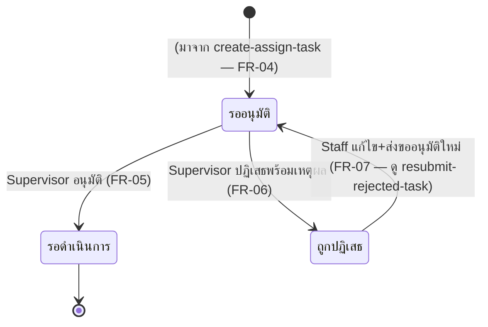

# Detailed Design: อนุมัติ/ปฏิเสธงานโดย Supervisor

เอกสารนี้อธิบายการออกแบบระดับ component ของฟีเจอร์
[[feature-list#2. อนุมัติ/ปฏิเสธงานโดย Supervisor|อนุมัติ/ปฏิเสธงานโดย Supervisor]] แปลงจาก
[[user-journey#Journey: Supervisor ตรวจสอบและอนุมัติ/ปฏิเสธงาน]] (ส่วนขั้นตอนที่ 1–5) เป็นลำดับการ
เรียก operation จริงตาม [[api-spec]] และผลกระทบต่อ entity ตาม [[db-spec]] อ้างอิง component จาก
[[architecture]] (Client / Backend Service: Controller–Service–Repository layer / Primary Data
Store)

รหัส FR/NFR ที่ครอบคลุม:
[[20260815-02-supervisor-task-approval#Functional Requirements (FR)|FR-04]],
[[20260815-02-supervisor-task-approval#Functional Requirements (FR)|FR-05]],
[[20260815-02-supervisor-task-approval#Functional Requirements (FR)|FR-06]],
[[20260815-02-supervisor-task-approval#Non-Functional Requirements (NFR)|NFR-02]]

หมายเหตุ: FR-04 (การตั้งสถานะ "รออนุมัติ" หลังมอบหมายงาน) เกิดขึ้นจริงภายใน operation
[[api-spec#1. สร้างงานใหม่และมอบหมายงาน|1. สร้างงานใหม่และมอบหมายงาน]] ซึ่งออกแบบไว้แล้วใน
[[create-assign-task]] เอกสารนี้จึงกล่าวถึง FR-04 เฉพาะในมุมของจุดเริ่ม (entry point) ของ
sequence นี้เท่านั้น ไม่ออกแบบซ้ำ

## Sequence Diagram

ใช้ 3 operation จาก [[api-spec]]: [[api-spec#2. ดึงรายละเอียดงาน|2. ดึงรายละเอียดงาน]],
[[api-spec#4. อนุมัติงาน|4. อนุมัติงาน]], [[api-spec#5. ปฏิเสธงานพร้อมเหตุผล|5. ปฏิเสธงานพร้อม
เหตุผล]] (operation [[api-spec#3. ดึงรายการงานที่รออนุมัติสำหรับ Supervisor|3. ดึงรายการงานที่รอ
อนุมัติสำหรับ Supervisor]] และ [[api-spec#7. ดึงรายการแจ้งเตือนของผู้ใช้ที่ล็อกอินอยู่|7. ดึงรายการ
แจ้งเตือน]] เป็น operation สนับสนุนที่ Supervisor ใช้ก่อนเปิดดูรายละเอียดงาน แสดงเป็น note
เพื่อไม่ให้ diagram หลักซับซ้อนเกินจำเป็น)

## Operation ↔ Entity ที่กระทบ

| ลำดับ | Operation ([[api-spec]]) | Entity ที่กระทบ ([[db-spec]]) | การกระทำ | หมายเหตุลำดับก่อน-หลัง |
|-------|---------------------------|----------------------------------|----------|---------------------------|
| 1 | [[api-spec#2. ดึงรายละเอียดงาน\|2. ดึงรายละเอียดงาน]] | `Task`, `TeamProjectMembership`, `TaskComment` | อ่าน | ต้องอ่านและตรวจสอบสิทธิ์ก่อนแสดงรายละเอียด/อนุญาตให้ตัดสินใจอนุมัติหรือปฏิเสธ |
| 2 | [[api-spec#4. อนุมัติงาน\|4. อนุมัติงาน]] | `Task` | แก้ไข (สถานะ: "รออนุมัติ" → สถานะเริ่มดำเนินการ) | ต้องตรวจสอบสถานะปัจจุบัน = "รออนุมัติ" ก่อนแก้ไขเสมอ (mutual exclusive กับ operation 5) |
| 2.1 | เดียวกัน | `TaskStatusHistory` | สร้างใหม่ | เกิดหลัง Task อัปเดตสำเร็จ ในธุรกรรมเดียวกัน |
| 2.2 | เดียวกัน | `Notification` | สร้างใหม่ (ให้ผู้ถูกมอบหมาย) | เกิดหลัง Task อัปเดตสำเร็จ |
| 3 | [[api-spec#5. ปฏิเสธงานพร้อมเหตุผล\|5. ปฏิเสธงานพร้อมเหตุผล]] | `TaskComment` | สร้างใหม่ (เหตุผลการปฏิเสธ) | ต้องบันทึกก่อน `TaskStatusHistory` เพื่อให้มี id ไว้อ้างอิง (optional reference) |
| 3.1 | เดียวกัน | `Task` | แก้ไข (สถานะ: "รออนุมัติ" → "ถูกปฏิเสธ") | ต้องตรวจสอบสถานะปัจจุบัน = "รออนุมัติ" และมีเหตุผลก่อนแก้ไขเสมอ |
| 3.2 | เดียวกัน | `TaskStatusHistory` | สร้างใหม่ (อ้างอิงถึง `TaskComment` ที่สร้างในขั้นตอน 3) | เกิดหลัง TaskComment และ Task ถูกอัปเดตสำเร็จ |
| 3.3 | เดียวกัน | `Notification` | สร้างใหม่ (ให้ Staff ผู้สร้างงานและผู้ถูกมอบหมาย — 2 รายการ) | เกิดหลัง Task อัปเดตสำเร็จ |

## State Diagram (สถานะของ Task)

ครอบคลุม transition ที่ 2 ของ workflow: "รออนุมัติ" → สถานะเริ่มดำเนินการ (อนุมัติ) หรือ "รออนุมัติ"
→ "ถูกปฏิเสธ" (ปฏิเสธ) จุดเริ่ม "รออนุมัติ" มาจาก [[create-assign-task]] (FR-04) ส่วนวงจรกลับจาก
"ถูกปฏิเสธ" → "รออนุมัติ" อีกครั้งเป็นของ [[resubmit-rejected-task]] (FR-07)

## Edge Case และวิธีจัดการ

อ้างอิง [[acceptance-criteria#2. อนุมัติ/ปฏิเสธงานโดย Supervisor]] และ
[[test-cases/supervisor-task-approval|test-cases: supervisor-task-approval]] (TC-02-01–TC-02-08)

| Edge Case | วิธีจัดการ | อ้างอิง |
|-----------|------------|---------|
| Supervisor ของทีม/โครงการอื่นพยายามอนุมัติ/ปฏิเสธงาน | Service layer ตรวจสอบ `TeamProjectMembership` บทบาท Supervisor ในทีม/โครงการเดียวกับ `Task.ทีม/โครงการ` ก่อนทุกครั้ง ปฏิเสธคำขอทันทีถ้าไม่ตรงกัน ไม่ว่าจะเรียกผ่านช่องทางใด | NFR-02, TC-02-08 |
| อนุมัติงานที่ไม่ได้อยู่ในสถานะ "รออนุมัติ" (เช่น อนุมัติซ้ำ หรือถูกปฏิเสธไปแล้ว) | Service layer ตรวจสอบสถานะปัจจุบันก่อนอัปเดตทุกครั้ง ปฏิเสธคำขอพร้อมแจ้งสถานะปัจจุบัน ไม่แก้ไขข้อมูล | FR-05, TC-02-03 |
| ปฏิเสธงานที่ไม่ได้อยู่ในสถานะ "รออนุมัติ" | เช่นเดียวกับกรณีอนุมัติซ้ำ — ตรวจสอบสถานะก่อนแก้ไขเสมอ | FR-06, TC-02-07 |
| ปฏิเสธงานโดยไม่ระบุเหตุผล | Service layer บังคับให้มีเหตุผล (`TaskComment.เนื้อหา`) ก่อนเปลี่ยนสถานะเสมอ ปฏิเสธคำขอถ้าไม่มีเหตุผล ไม่เปลี่ยนสถานะงาน | FR-06, TC-02-06 |
| ไม่พบ Task ตาม id ที่ระบุ (ทั้งดึงรายละเอียด/อนุมัติ/ปฏิเสธ) | แจ้งไม่พบข้อมูล ไม่ดำเนินการต่อ | FR-05/FR-06 (กรณี error หลัก), TC-02-04 |
| ผู้เรียกไม่มีสิทธิ์เข้าถึงรายละเอียดงาน (ไม่ใช่ผู้สร้าง/ผู้ถูกมอบหมาย/Supervisor ในทีม/โครงการเดียวกัน) | ปฏิเสธคำขอดึงรายละเอียด ก่อนถึงขั้นตอนตัดสินใจอนุมัติ/ปฏิเสธ | NFR-02 |

## เอกสารที่เกี่ยวข้อง

- [[api-spec]]
- [[db-spec]]
- [[architecture]]
- [[feature-list]]
- [[user-journey]]
- [[acceptance-criteria]]
- [[test-cases/supervisor-task-approval]]
- [[create-assign-task]]
- [[resubmit-rejected-task]]
- [[20260815-02-supervisor-task-approval]]
