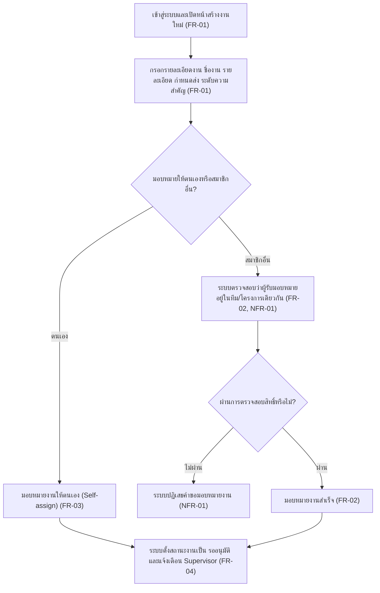
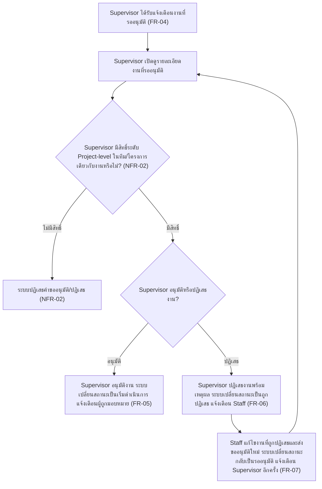

# User Journey

เอกสารนี้แมปฟีเจอร์จาก [[feature-list]] เป็น flow การใช้งานจริงตามบทบาทผู้ใช้ (Staff / Supervisor)
แบบ step-by-step พร้อมแผนภาพ Mermaid flowchart กำกับทุก journey เพื่อให้เห็นภาพรวมได้เร็วก่อน
อ่านรายละเอียดแบบข้อความ อ้างอิงรหัส FR/NFR กลับไปยังเอกสาร spec ต้นทาง:
[[20260815-01-task-creation-assignment]] และ [[20260815-02-supervisor-task-approval]]

## Journey: Staff สร้างงานใหม่และมอบหมายงานให้ทีม

บทบาท: Staff

ขั้นตอน:

1. Staff เข้าสู่ระบบและเปิดหน้าสร้างงานใหม่ ([[20260815-01-task-creation-assignment#Functional Requirements (FR)|FR-01]])
2. กรอกรายละเอียดงาน: ชื่องาน, รายละเอียด (Rich Text), กำหนดส่ง (Due Date), ระดับความสำคัญ
   (Priority) — ระบบกำหนดสถานะเริ่มต้นให้อัตโนมัติ ([[20260815-01-task-creation-assignment#Functional Requirements (FR)|FR-01]])
3. เลือกว่าจะมอบหมายงานให้ตนเองหรือสมาชิกอื่นในทีม/โครงการเดียวกัน:
   - ถ้าเลือกตนเอง: ระบบอนุญาตให้มอบหมายงานให้ตนเองได้ทันที (Self-assign)
     ([[20260815-01-task-creation-assignment#Functional Requirements (FR)|FR-03]])
   - ถ้าเลือกสมาชิกอื่น: ระบบตรวจสอบว่าผู้ถูกมอบหมายเป็นสมาชิกของทีม/โครงการเดียวกันก่อนบันทึก
     การมอบหมายทุกครั้ง ([[20260815-01-task-creation-assignment#Functional Requirements (FR)|FR-02]],
     [[20260815-01-task-creation-assignment#Non-Functional Requirements (NFR)|NFR-01]])
4. ถ้าตรวจสอบสิทธิ์ไม่ผ่าน (ผู้ถูกมอบหมายไม่ได้อยู่ในทีม/โครงการเดียวกัน) ระบบปฏิเสธคำขอมอบหมายงาน
   ทุกกรณี ([[20260815-01-task-creation-assignment#Non-Functional Requirements (NFR)|NFR-01]])
5. ถ้าตรวจสอบสิทธิ์ผ่าน มอบหมายงานสำเร็จ
   ([[20260815-01-task-creation-assignment#Functional Requirements (FR)|FR-02]])
6. เมื่อมอบหมายงานสำเร็จ (ไม่ว่าจะเป็นกรณี self-assign หรือมอบหมายให้สมาชิกอื่น) ระบบตั้งสถานะงาน
   เป็น "รออนุมัติ" โดยอัตโนมัติ และแจ้งเตือน Supervisor ของทีม/โครงการนั้นทันที
   ([[20260815-02-supervisor-task-approval#Functional Requirements (FR)|FR-04]]) — ต่อยอดไปยัง
   journey ถัดไป

## Journey: Supervisor ตรวจสอบและอนุมัติ/ปฏิเสธงาน

บทบาท: Supervisor และ Staff (สำหรับขั้นตอนแก้ไขงานที่ถูกปฏิเสธ)

ขั้นตอน:

1. Supervisor ได้รับการแจ้งเตือนว่ามีงานเข้าสถานะ "รออนุมัติ"
   ([[20260815-02-supervisor-task-approval#Functional Requirements (FR)|FR-04]])
2. Supervisor เปิดดูรายละเอียดงานที่รออนุมัติ
3. ระบบตรวจสอบว่า Supervisor มีสิทธิ์ระดับ Project-level ในทีม/โครงการเดียวกับงานนั้นหรือไม่
   ([[20260815-02-supervisor-task-approval#Non-Functional Requirements (NFR)|NFR-02]])
4. ถ้าไม่มีสิทธิ์: ระบบปฏิเสธคำขออนุมัติ/ปฏิเสธจากผู้ใช้รายนั้นทุกช่องทางที่เรียกใช้งาน
   ([[20260815-02-supervisor-task-approval#Non-Functional Requirements (NFR)|NFR-02]])
5. ถ้ามีสิทธิ์: Supervisor เลือกอนุมัติหรือปฏิเสธงาน
   - อนุมัติ: ระบบเปลี่ยนสถานะงานเป็นสถานะเริ่มดำเนินการ (เช่น "รอดำเนินการ") และแจ้งเตือนผู้ถูก
     มอบหมาย ([[20260815-02-supervisor-task-approval#Functional Requirements (FR)|FR-05]])
   - ปฏิเสธ: Supervisor ต้องระบุเหตุผลการปฏิเสธ (บันทึกเป็น Rich Text/comment ผูกกับ Task) ระบบ
     เปลี่ยนสถานะงานเป็น "ถูกปฏิเสธ" และแจ้งเตือน Staff ผู้สร้างงานและผู้ถูกมอบหมาย
     ([[20260815-02-supervisor-task-approval#Functional Requirements (FR)|FR-06]])
6. หากถูกปฏิเสธ: Staff ผู้สร้างงานแก้ไขรายละเอียดงานแล้วส่งขออนุมัติใหม่ ระบบเปลี่ยนสถานะงานกลับ
   เป็น "รออนุมัติ" อีกครั้ง และแจ้งเตือน Supervisor อีกครั้ง วนกลับไปยังขั้นตอนที่ 2 จนกว่างานจะ
   ได้รับการอนุมัติ ([[20260815-02-supervisor-task-approval#Functional Requirements (FR)|FR-07]])
